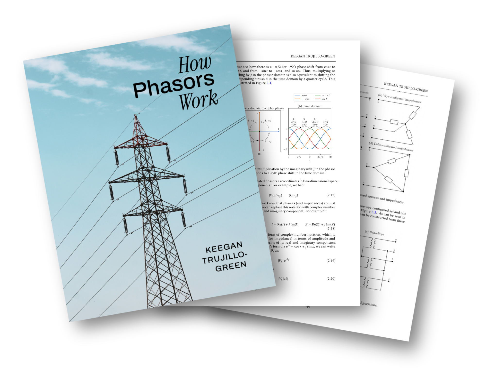

{button}`Download the PDF <https://raw.githubusercontent.com/keeganmjgreen/how_phasors_work/refs/heads/main/how_phasors_work.pdf>`

::::{grid} 1 1 2 3

:::{card}
:header: Introduction &nbsp;
:link: /introduction
Basics of DC versus AC power and resistive versus reactive loads.
:::

:::{card}
:header: What is a Phasor? &nbsp;
:link: /what-is-a-phasor
Relationship between sinusoids and phasors. Deriving the concept of phasors. Formal phasor transformation and notation.
:::

:::{card}
:header: Life With and Without Phasors: Example Circuit Analysis
:link: /life-with-and-without-phasors
Seeing the benefits of phasors in practice over differential equations and the Laplace transform.
:::

:::{card}
:header: Complex Power and the Power Factor
:link: /complex-power-and-the-power-factor
Deriving complex power and the power triangle from time-domain instantaneous power. Power factor and power factor correction.
:::

:::{card}
:header: Three-Phase Power &nbsp;
:link: /three-phase-power
Motivation for three-phase power. Wye versus delta configurations. Three-phase power in the grid.
:::

:::{card}
:header: Grid Modeling &nbsp;
:link: /grid-modeling
Bus injection model. Power flow, optimal power flow, economic dispatch, and unit commitment problems.
:::
::::

This book is a work in progress. Existing chapters will be revised, and new chapters will be added. Readers are encouraged to provide feedback [here](https://github.com/keeganmjgreen/how_phasors_work/issues).

---

© 2025&ndash;2026 Keegan Green. Written without AI.
