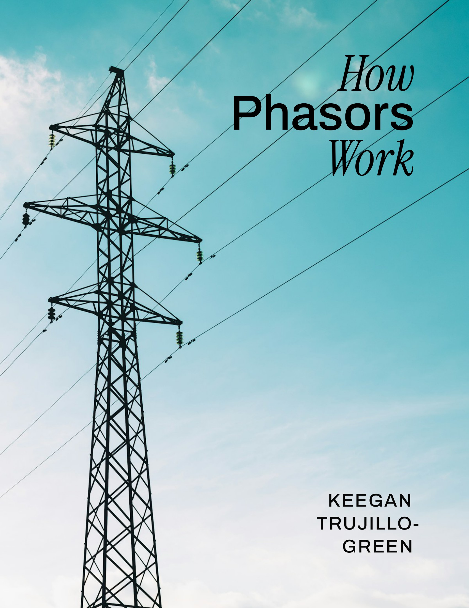

# How Phasors Work

[Web](https://keeganmjgreen.github.io/how_phasors_work) | [PDF](https://raw.githubusercontent.com/keeganmjgreen/how_phasors_work/refs/heads/main/how_phasors_work.pdf)

An electrical engineering book about phasors and applying AC circuit analysis to the electrical grid.

This book is a work in progress. Existing chapters will be revised, and new chapters will be added. Readers are encouraged to provide feedback in [Issues](https://github.com/keeganmjgreen/how_phasors_work/issues).

Cover image by Rodion Kutsaiev on Unsplash.

© 2025&ndash;2026 Keegan Green

## Development

When authoring locally, preview the HTML version of the book using `uvx jupyter-book start`. Alternatively, run the "Start Jupyter Book (Web)" task in VS Code. Then, open the resulting URL (likely http://localhost:3000).

Build the final PDF version of the book using `source build_pdf.sh`. Alternatively, run the "Build PDF" task in VS Code. This converts the source files (`.ipynb`, `.md`) to `how_phasors_work.pdf` using Jupyter Book, MyST, and LaTeX.
